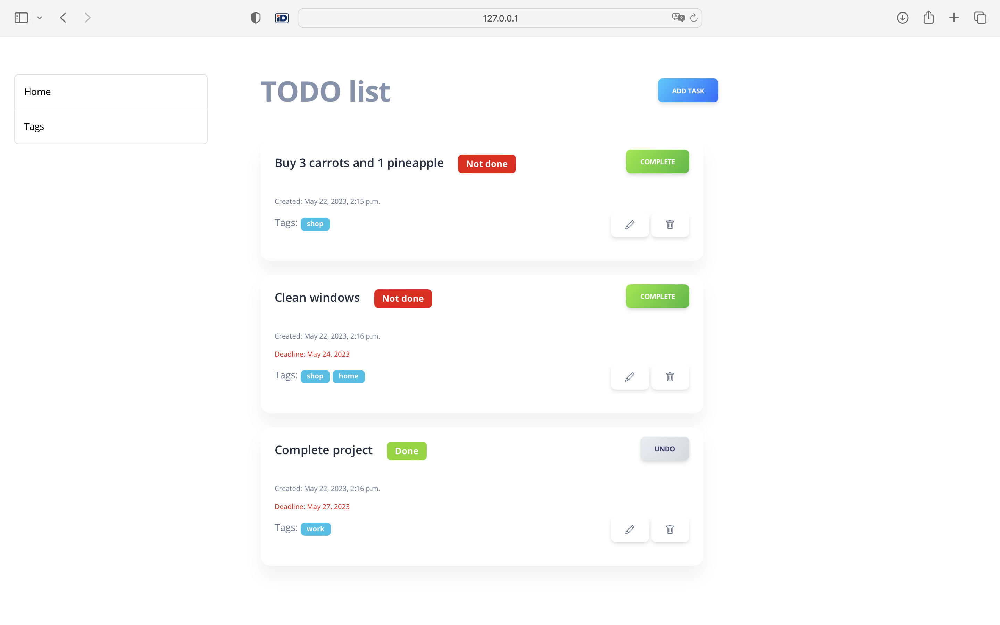
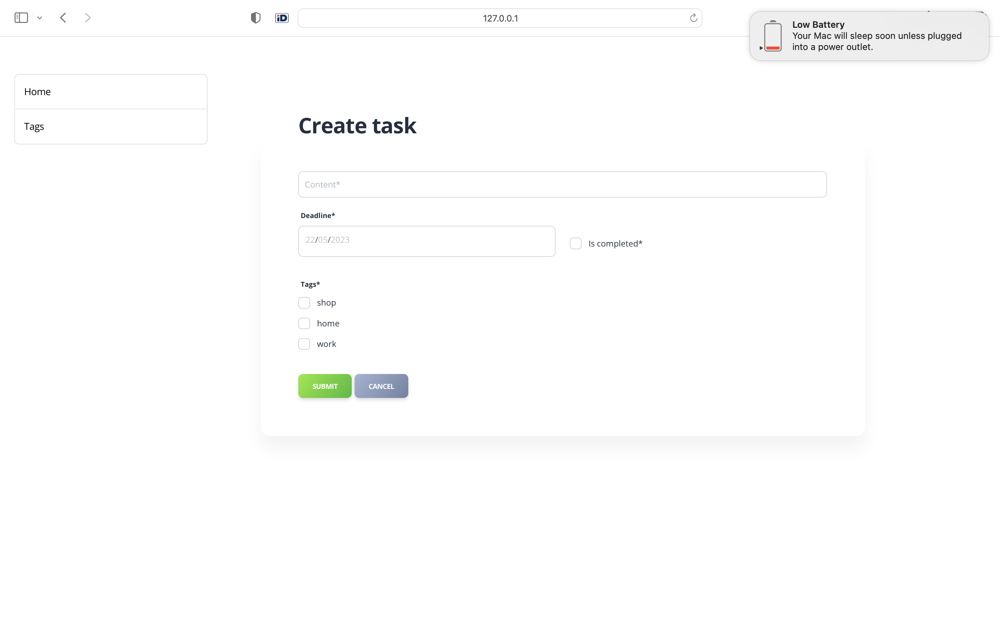
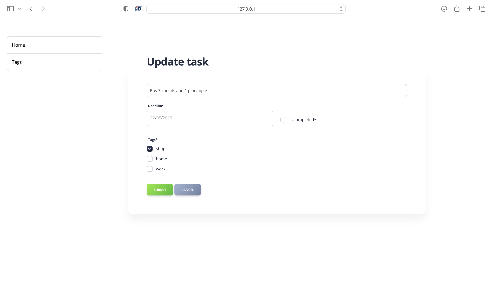
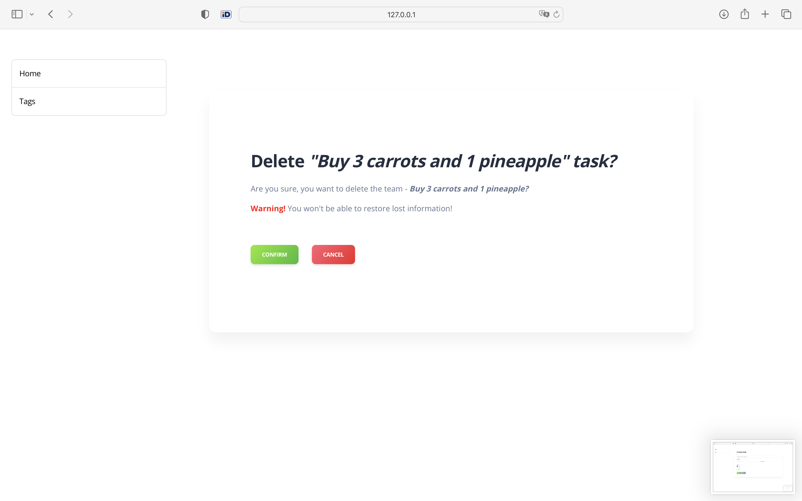
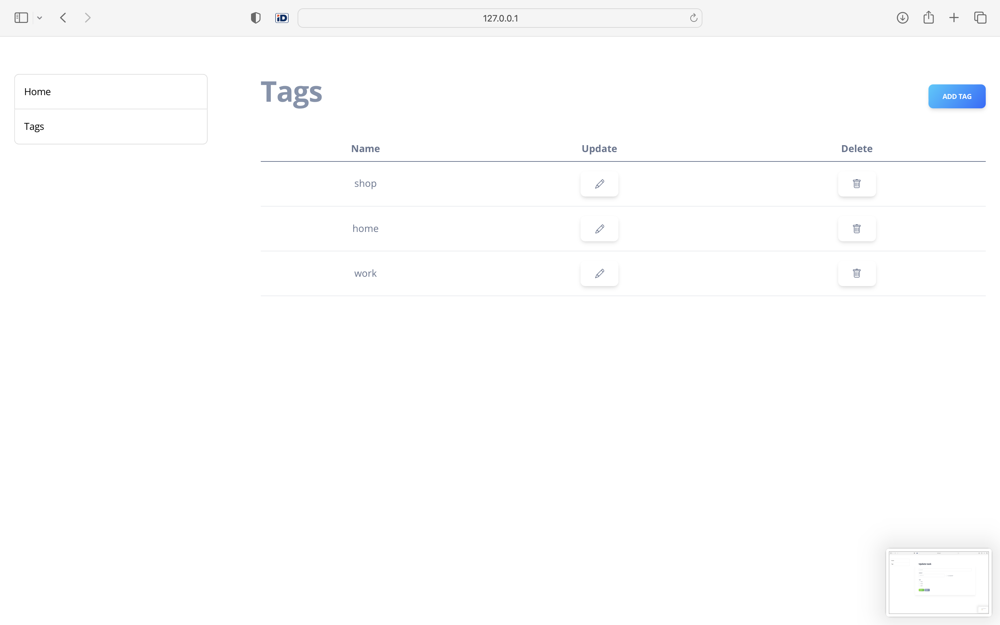
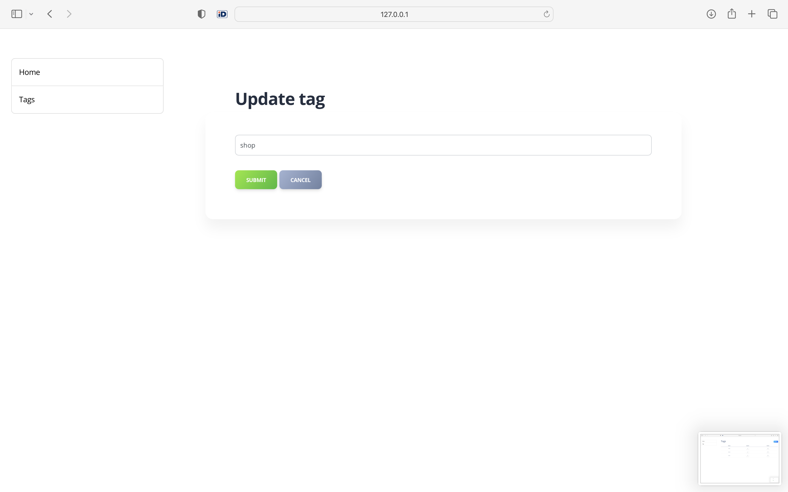
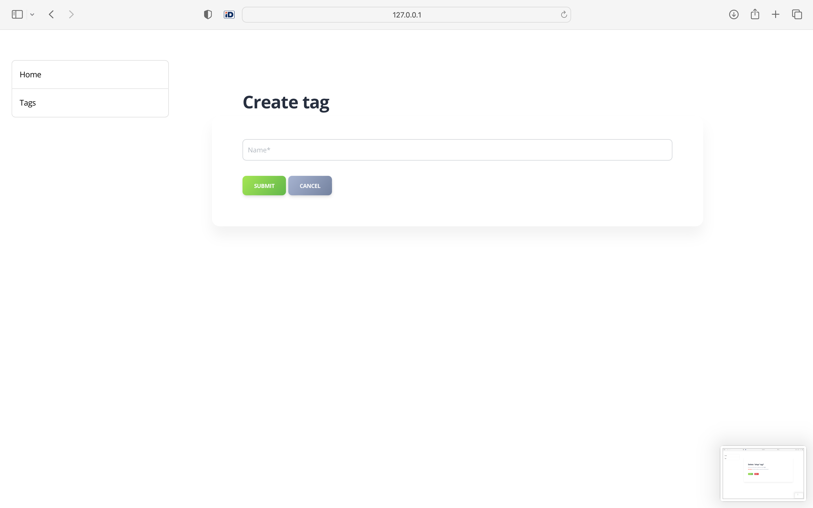
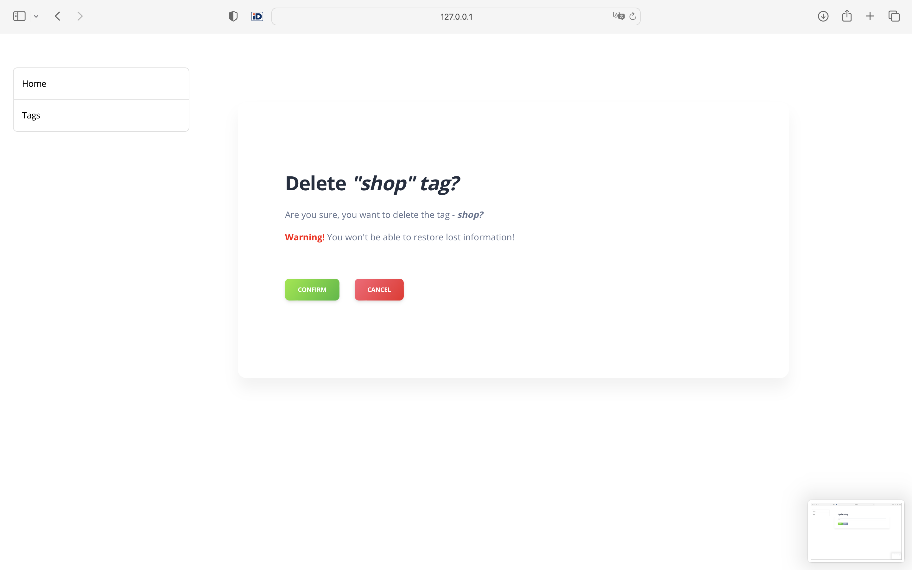

# Task List
This is the system to manage different tasks. You can create new task, add tags to it, update and delete it.

Here the interface of the Task List:

Home page

Toggle to change the task status

Create task

Update task

Delete task 

Tag list

Update tag

Create tag

Delete tag

